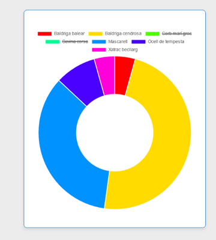

= Projecte Plomes al mar

Benvinguts a la presentació de Plomes al mar! 
Us presentem un projecte d'aplicació web corresponent al projecte final M12 corresponent al treball final del grau superior de disseny d'aplicacions web (DAW) de l'institut Nicolau Copèrnic de Terrassa.

En aquest projecte us presentem el projecte Plomes al mar, un projecte de recerca i difusió del coneixement de les espècies d'aus en un entorn marítim a través d'una aplicació web, on els amants de l'ornitologia podran compartir les seves experiències i interès per les aus.

L'aplicació està construïda a través de la participació dels usuaris que, mitjançant la creació d'un perfil, podran compartir les seves experiències. Aquesta aplicació té l'objectiu de crear una comunitat digital sobre els amants de l'ornitologia i estendre el coneixement sobre les espècies d'aus que podem trobar en el nostre apreciat entorn natural.

Es tracta d'una aplicació web de participació col·lectiva on cada usuari podrà registrar les espècies vistes i afegir informació extra sobre l'espècie, l'albirament en qüestió, sortides, transectes, vaixells i afegir imatges.

A continuació us farem un manual d'introducció a l'aplicació a través d'una guia d'usuari on explicarem el funcionament de l'aplicació i totes les opcions i accions que els usuaris podran realitzar.

== L'aplicació

L'aplicació està formada per dos subapartats principals: l'apartat de gestió i el quadre de comandament.

L'apartat de gestió és la part col·laborativa del projecte, on cada usuari a través del seu perfil podrà afegir la informació sobre les seves sortides a la mar i afegir detalls sobre les espècies i el moment en què s'ha produït l'albirament, així com informació sobre el vaixell, trajecte i espècie vista.

El segon apartat és el quadre de comandament, la part d'observació de la informació prèviament introduïda pels usuaris, on es podrà filtrar per data de sortida i realitzar consultes sobre les espècies vistes i la quantitat, consultar la informació comparativa de cada espècie i veure la informació presentada mitjançant gràfics.

A continuació us mostrarem els principals aspectes i accions de l'aplicació:

== Apartat de gestió

En aquest apartat podem veure l'espai de gestió del projecte Plomes al mar, un projecte dedicat a la recerca i difusió del coneixement de les espècies d'aus en un entorn marítim.

En aquest primer apartat trobem els ítems de sortida, observació, espècie, vaixell i transecte, apartats on es podrà introduir i modificar la informació dels apartats nomenats anteriorment i que és la part col·laborativa de l'aplicació web on els usuaris poden documentar les seves experiències.

Mostrarem més endavant en el projecte de documentació, aquests apartats de l'espai de gestió.

=== Apartat sortida

En aquest apartat l'usuari pot registrar les sortides que ha fet. Es veu la informació en format taula. Els camps d'aquesta taula són el nom del vaixell i el nom del transecte, apartat que identifica les rutes de moviment dels vaixells, un terme usat en navegació marina, i la data en la qual s'ha realitzat aquesta sortida.

L'usuari pot afegir aquestes sortides i modificar i editar l'edició d'aquelles ja creades.

Dintre de les accions trobem l'apartat d'informació, on es pot veure de manera resumida les dades més importants de la sortida:

Una altra de les accions que podrà fer l'usuari serà editar la informació de la mateixa.

*Pendent

Eliminar la sortida (falta captura).

=== Apartat observació

En aquest apartat podem veure la informació de les espècies observades durant la sortida. Aquesta informació es mostra en format taula.

Dins d'aquest apartat podem introduir l'hora en què hem vist l'espècie, la coordenada on hem vist l'espècie en qüestió (waypoint), el nombre d'unitats, una imatge opcional que l'observador pot carregar si ha fet una fotografia de l'ocell, i marcar les opcions de si l'ha vist en ple vol o l'ha vist des de menys de 300 metres.

Trobem un apartat de detalls, on podem veure la informació de l'albirament.

Editar-ne els detalls un cop creat el registre.

Eliminar el registre.

Crear un nou registre afegint tots els detalls mencionats anteriorment.

=== Apartat d'espècies

Dintre de l'apartat de gestió trobem l'apartat d'Espècies. En format taula podem veure el nom comú i el nom científic de les aus vistes durant els nostres viatges i sortides.

Dintre de l'apartat d'espècies trobem un buscador que exerceix de filtre per poder fer cerques pel nom comú i científic d'aquestes.

Tenim un espai on podem editar els detalls de les espècies introduïdes canviant el nom comú i científic de l'espècie.

Afegir noves espècies amb els mateixos camps que passaran a formar part de la taula principal.

En aquest apartat no esta previst la opció d'eliminar una espècie que ja ha estat albirada.

=== Apartat vaixell

En aquest apartat podem veure en format taula el llistat de tots els vaixells registrats que formen part de l'organització. Aquesta taula està composta de dos camps: el nom del vaixell i la matrícula d'identificació d'aquest. L'usuari pot filtrar a través del buscador.

L'usuari, segons el seu nivell de permisos, pot editar la informació:

image::./imatges/pam24_editar-vaixell.png[Editar un vaixell]

I afegir-ne un de nou.

En aquest apartat no esta previst de poder eliminar els vaixells que ha estat utilitzats en algún moment per l'associació

=== Apartat transecte

En aquest apartat podem veure les rutes navals o transectes que s'han afegit al projecte Plomes al mar. Cada ruta compta amb un nom d'identificació. El concepte transecte és un terme utilitzat habitualment en la navegació marítima per indicar les rutes que poden realitzar els vaixells i la ubicació d'aquestes, per, en cas de necessitar assistència, saber la seva localització. Un funcionament semblant al de les carreteres en el transport terrestre.

. En aquest apartat podem afegir noves rutes i editar les existents.

image::./imatges/pam24_afegir-transecte.png[Afegir un transecte]

image::./imatges/pam24_editar-vaixell.png[Editar un transecte]

== Apartat quadre de comandament

El quadre de comandament és l'eina de consulta de la base de dades de la qual està format el projecte. En aquest apartat podem veure informació, resums i gràfics de les observacions d'espècies introduïdes a la base de dades.

Aquest espai està format pels apartats total, comparatiu i varietat.

=== Apartat total

L'apartat total compta amb un quadre de selecció mitjançant llistat desplegable on es pot seleccionar entre totes les espècies introduïdes en la base de dades i, en realitzar la selecció, mostra un gràfic resum de l'espècie, les vegades que s'ha vist i la quantitat organitzada per mesos, seleccionant la informació de la base de dades.

=== Apartat comparatiu 

*Pendent

En aquest apartat podem realitzar una comparació de les espècies i la quantitat de vegades que han sigut vistes classificades per mesos.

Podem seleccionar fins a cinc espècies.
Actualitzar el gràfic a través dels botons.

I com a resultat s'observaran les espècies observades i es compararan per mesos segons els anys seleccionats.

Finalment, es podrà veure la quantitat d'ocells que s'han vist filtrant per data de la sortida. Com a resultat, es mostra un gràfic interactiu circular amb les espècies i la quantitat, on l'usuari pot seleccionar i decidir si es mostra o no, en cas que vulgui comparar unes espècies en concret dintre de la sortida.

== Apartat contacte

En aquest apartat trobem un formulari de contacte perquè els usuaris registrats a l'aplicació puguin fer arribar un email als administradors. Amb els seus dubtes i/o aportacions sobre el projecte. Aquest formulari envia un correu electrònic a l'administració del projecte. Les dades són afegides a un fitxer per al correcte compliment del RGPD vigent.

== Apartat Administració

En l'apartat d'administració podem veure el quadre de comandament de l'usuari, apartat on pot iniciar i tancar la sessió. Es mostra una salutació a l'usuari i l'opció de tancar sessió.

image::./imatges/pam24_llista-administració.png[Llista d'administració]

Per aquells usuaris en rol d'administració, veuen l'apartat corresponent, on es poden gestionar i veure els usuaris que té l'aplicació, modificar i afegir o treure rols com el d'administració i editor.

En aquest quadre d'administració es poden crear nous usuaris.
Veure els detalls de l'usuari, on es podran afegir i eliminar rols que podrà fer aquest usuari.

Podem editar els usuaris, si cal modificar les seves dades. Les modificacions només les poden fer els administradors

I per últim, eliminar usuaris.

Els administradors del sistema també tenen lòpcio d'afegir o retirar els rols als usuaris

== Sistema en varis idiomes 

Dintre de la navegació per l'aplicació web, quant a usuaris, situada a la cantonada superior dreta, trobem un menú de navegació on l'usuari pot escollir l'idioma en el qual es mostrarà l'aplicació. 

A continuació mostrem diferents apartats de l'aplicació web en castellà i anglès:

Finestra de navegació de l'apartat d'espècies mostrat en anglès.

Finestra de l'apartat d'observacions dintre del menú de gestió mostrat en castellà.

== Navegació de l'aplicació

Dintre de tota l'aplicació web trobem dues formes de navegar funcionals, per un costat trobem la barra superior de navegació:

També tenim la barra de navegació lateral amb més opcions per canviar entre les diferents vistes que en ofereix l'aplicació.

